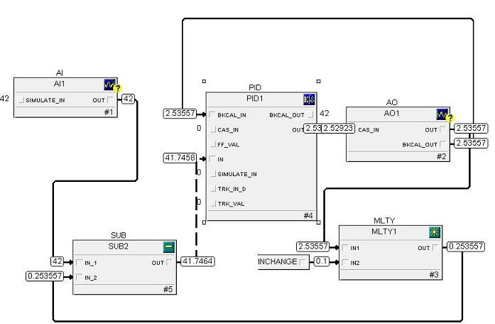
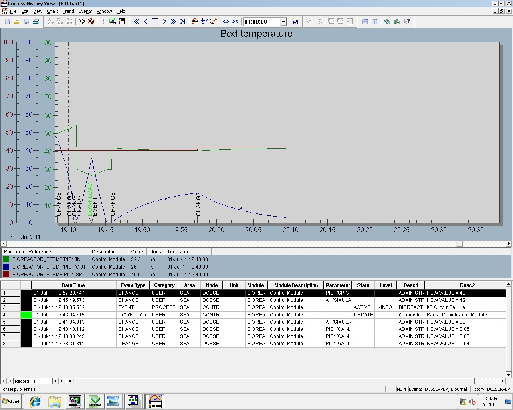

### The procedure for using simulator is as follows:
The graphical user interface developed for the fermentor plant using **EMERSON DELTA V DCS** is shown below.
In the offline or edit mode you can create necessary picture and Add amimations to it.
For this standard picture library is available.
In online or run mode the actual animation can be observed.

Following two pictures will clear the concept of Edit and Run Mode.

**EDIT/OFFLINE MODE picture:**

**RUN/ONLINE MODE picture:**

