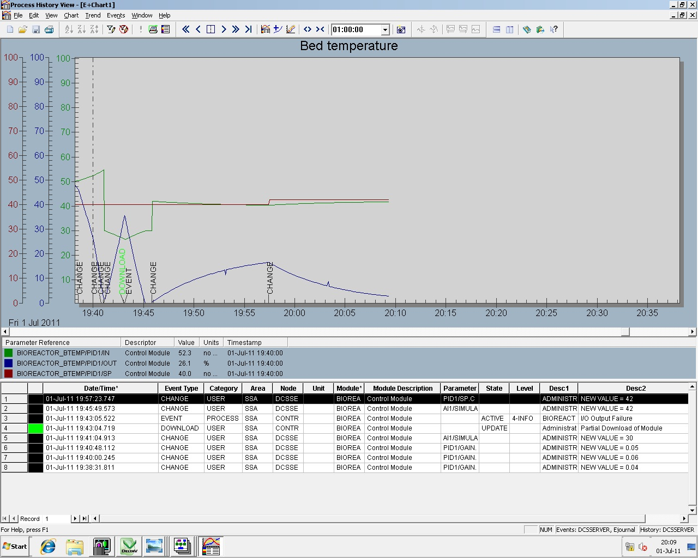
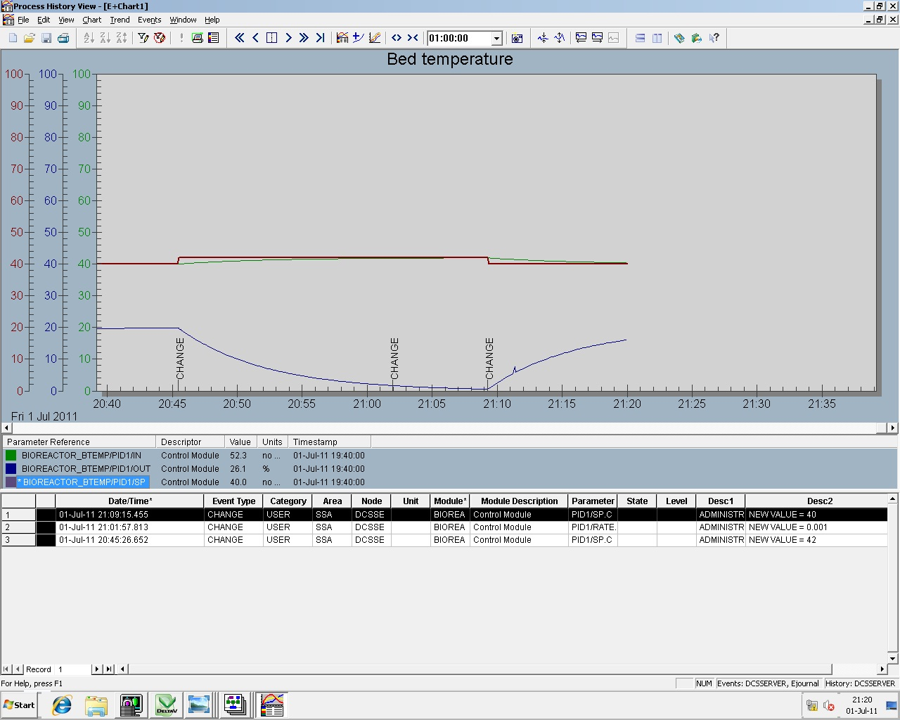
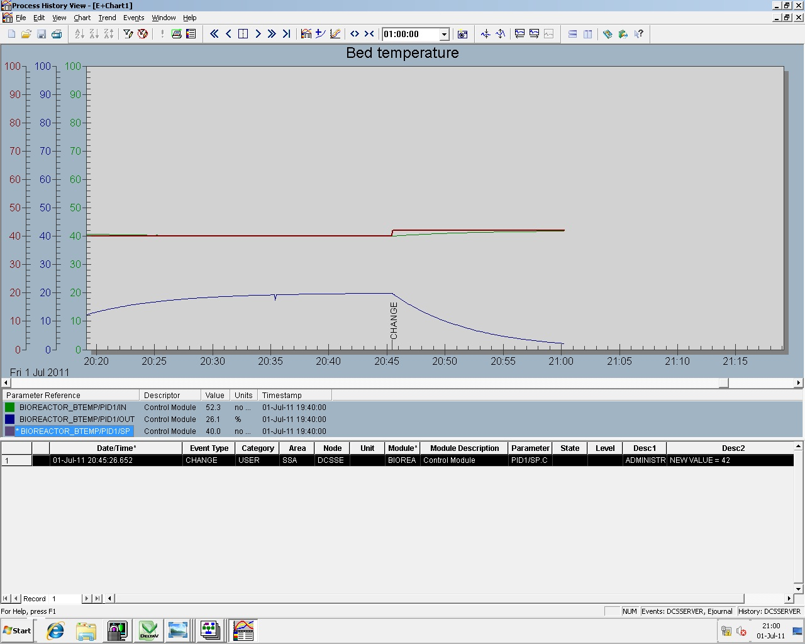
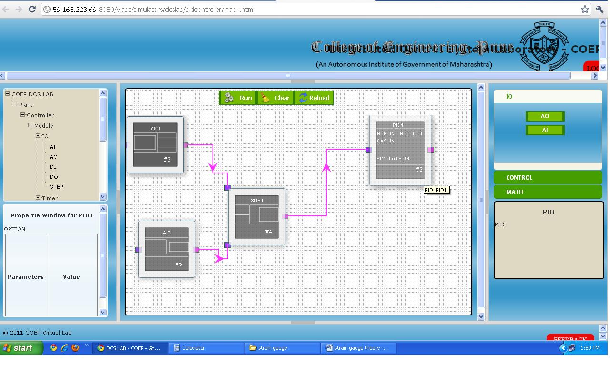

### The procedure for using simulator is as follows:
Steps for implementing the PID control scheme for autoclavable fermenter using **Emerson Delta-V DCS.**
This solution is implemented on **EMERSON DETA V DCS.**
1. First configure the function blocks as shown below.

2. Configure the P gain value for the controller without any Integral and Derivative action setting.
3. Set some random value of process input at simulate in terminal of AI block.
4. Observe the PID output changes by varying the feedback factor (multiplying gain).
5. Now by changing P gain observe the effect on PID output by disturbing the set point value
6. Introduce Integral action and repeat step 4 and 5
7. Then add derivative action to it and repeat step 4 and 5.
8. Obtain the PID parameters that give optimum process performance.

In DCS these effects can be observed graphically by configuring History View.

### **Some of the results obtained by implementing the control scheme on Emerson Delta-V are represented here.**

### **1. When the process first time settles down.**

### **2. After the rate action is introduced**

### **3. When set point disturbance is given to the process**

While implementing on Simulator, instead of feebback use two different inputs in the following mannner and give PID output value as input AI2 to SUB block.

