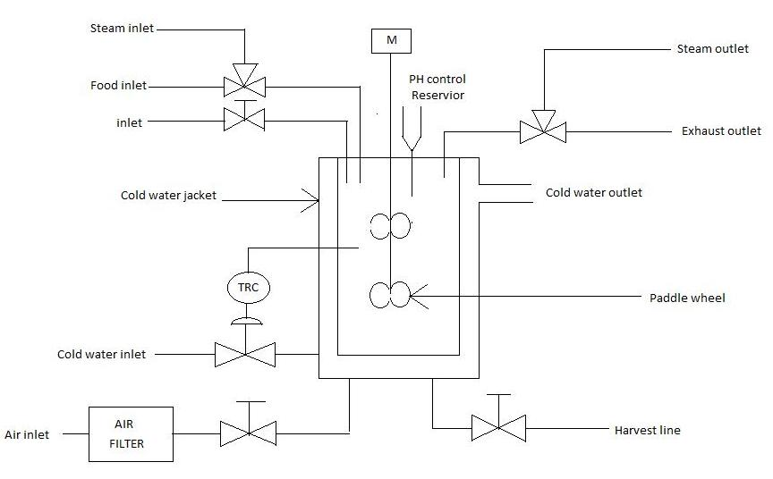
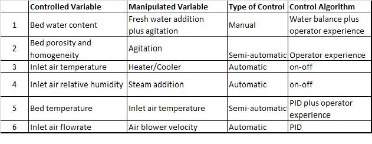
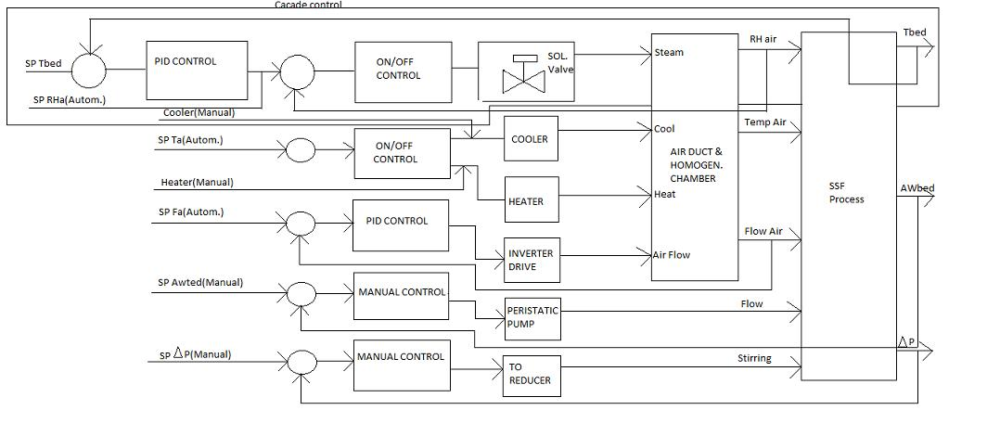

A fermenter is a manufactured or engineered system that supports a biologically active environment. It is a vessel in which a biological process is carried out which involves organisms or biochemically active substances obtained from such organisms. These substances comprise of food products, enzymes, drugs, alcohols, a biomass etc. These products are consumed in one or other form which demands for the level of sterility as per the FDA standards.

An autoclave is a system, distinct from the fermenter unit, in which the vessel and the culture medium is sterilized by subjecting it to high pressure saturated steam at 121&deg;C for a durations that varies with the capacity and size of the unit. Physically, it is a table top scaled down model designed for the laboratory application. Hence, the name Autoclavable Laboratory Fermenter. The fermenter along with its accessories is shown here.

### Need of Automatic Control for the fermenter
Large amount of heat is generated as the fermentation process proceeds from start to completion. It involves living matter so the process demands accurate control of temperature.
The ratio of the heat transfer capacity to the metabolic heat generation rate is less which results in low productivity in case of pilot scale, hence there is a need for automatic control system.

The table below shows the different controlled variables, the related manipulated variables, the type of control used and the control algorithm for the bioreactor.

Fermentation process is one of the complex processes where automation is needed.
Tight control of the process parameters is the demand of the process for the qualitative product. In such situation, the possibility of manual control gets ruled out. To implement the accurate control, thorough insight of the process is essential.
Fermentation is a generic term. The significant parameters related to it can be better understood by taking a specific example. Let us consider the example of Koji process, a soy sauce formation. The process involves the fermentation of a mixture of soybeans and wheat flour by the organism Aspergillus Oryzae under controlled conditions. Temperature and inlet air humidity are the key parameters that need to be controlled for the good quality product.

Following diagram explains various control strategies that can be implemented for the fermenter.

